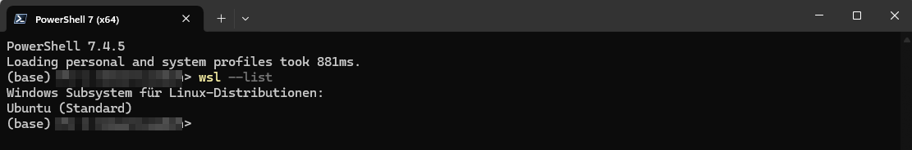
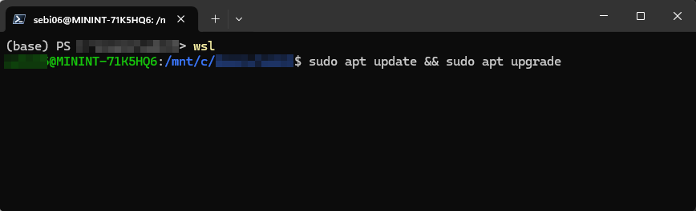
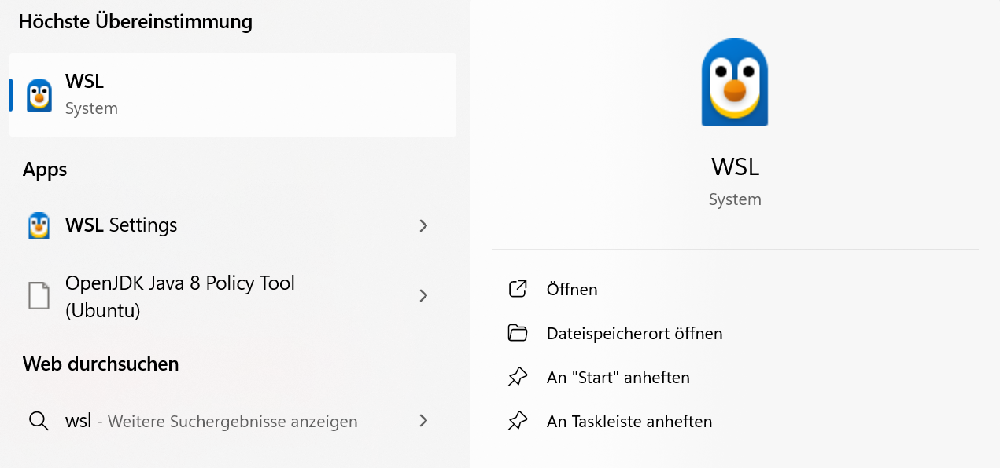
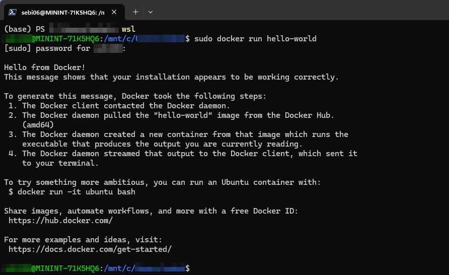
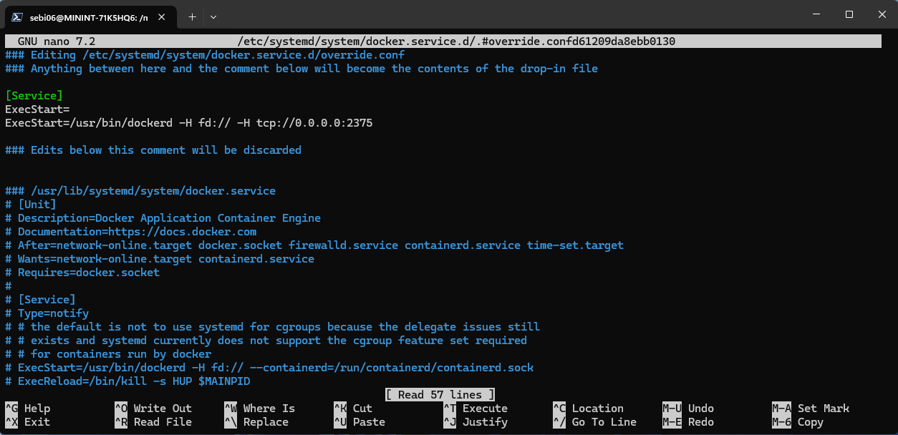
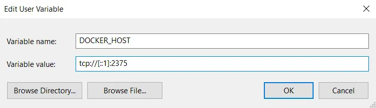
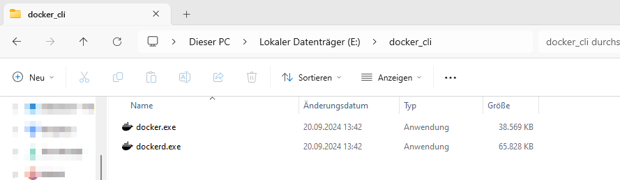
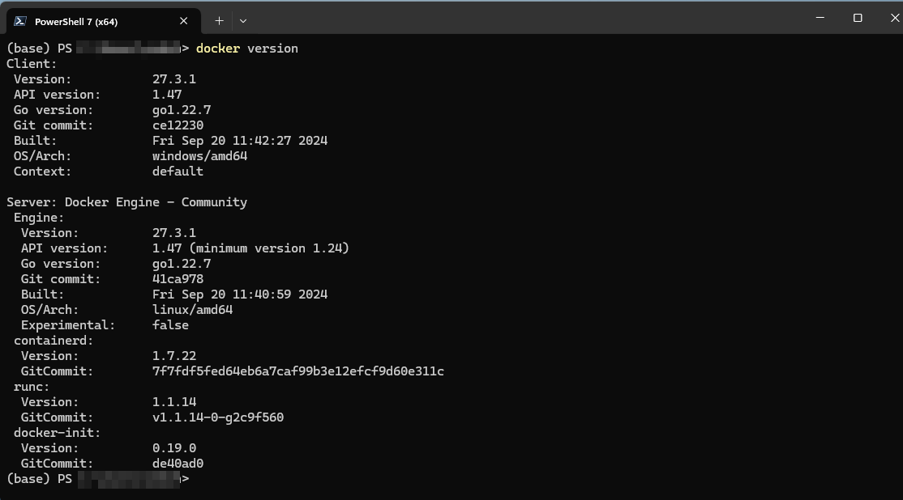

# Install Docker Runtime environment in WLS2

All steps are take from:

https://medium.com/@rom.bruyere/docker-and-wsl2-without-docker-desktop-f529d15d9398


## Concept

To use Docker without Docker Desktop the foloowing steps are required:

* Install WSL2, to serve as a runtime environment for Docker Engine
* Install Docker Engine inside WSL2, to be able to run containers
* Expose Docker Engine to be able to access it from Windows
* Install Docker command-line tools on Windows

## Install WSL 2

* open a terminal as admin

```shell
wsl --update
wsl --install
wsl --list --online
wsl --install -d Ubuntu
```

* verfify that Ubuntu is installed and is the default distro

```bash
wsl --list
```



* make sure linux is up-to-date
* start WLS2 using a terminal

```shell
sudo apt update && sudo apt upgrade
```



## Install Docker Engine on WSL2

* open WSL terminal
* exceute the two code blocks directly inside the terminal



### Code Block 1

```shell
sudo apt-get install ca-certificates curl
sudo install -m 0755 -d /etc/apt/keyrings
sudo curl -fsSL https://download.docker.com/linux/ubuntu/gpg -o /etc/apt/keyrings/docker.asc
sudo chmod a+r /etc/apt/keyrings/docker.asc
```

### Code Block 2

```shell
# Add the repository to Apt sources:
echo \
  "deb [arch=$(dpkg --print-architecture) signed-by=/etc/apt/keyrings/docker.asc] https://download.docker.com/linux/ubuntu \
  $(. /etc/os-release && echo "$VERSION_CODENAME") stable" | \
  sudo tee /etc/apt/sources.list.d/docker.list > /dev/null
sudo apt-get update
sudo apt-get install docker-ce docker-ce-cli containerd.io docker-buildx-plugin docker-compose-plugin
sudo docker run hello-world
```



### Add user to Docker user group

By default using `sudo` with Docker commands required for elevated permissions. To run Docker without `sudo`-->create a group docker for Docker users and add current user to that group.

```shell
sudo groupadd docker
sudo usermod -aG docker $USER
```

* close and reopen WSL termianl and try

```shell
docker run hello-world
```

### make sure Docker always starts when launching WSL

```shell
sudo systemctl enable docker.service
sudo systemctl enable containerd.service
```

## Expose Docker Engine to Windows using systemd

```shell
sudo systemctl edit docker.service
```

* modify the file in the correct place !!!

```txt
[Service]
ExecStart=
ExecStart=/usr/bin/dockerd -H fd:// -H tcp://0.0.0.0:2375
```



* restart the docker service

```shell
sudo systemctl daemon-reload
sudo systemctl restart docker.service
```

## Create the link between WSL2 and Windows

* add `DOCKER_HOST` to the `PATH` variable



* Depending on the configuration of PC and the activation of IPv6 set to: `tcp://localhost:2375` or `tcp://[::1]:2375`


## Install Docker CLI on Windows

* download Docker CLI
* store in a folder path of choice
* add folder path to `PATH` variable



* open mornal windows terminal

